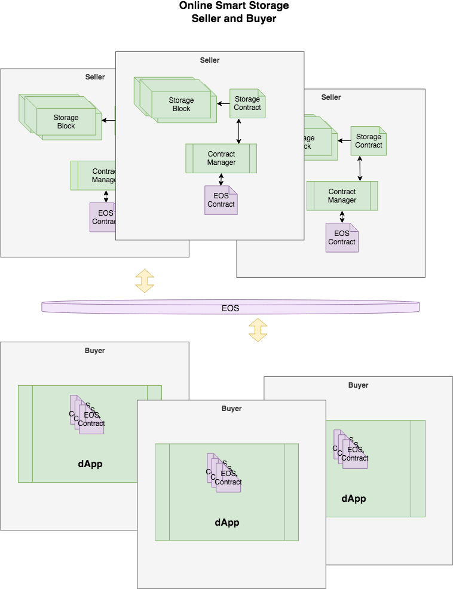

# Open Secure Storage
## EOS Smart-Contract for storage
----------------------
### Why

- Using smart-contracts to sell and buy online storage space

### Use

- Build then open browser to http://localhost:8080

```
  ./quick_start.sh
  cd frontend && npm install && npm start
  cd backend && npm install && npm start
```

### Design



### Refs
- Frame work using [React-starter-kit](https://github.com/kriasoft/react-starter-kit) for UI/UX
- Smart-Contract using [Aphrodite](https://github.com/airbnb/hypernova) for Virtual Machine
- EOS [tutorials](https://bitbucket.org/alexcompanies/tutorial-eos) online
