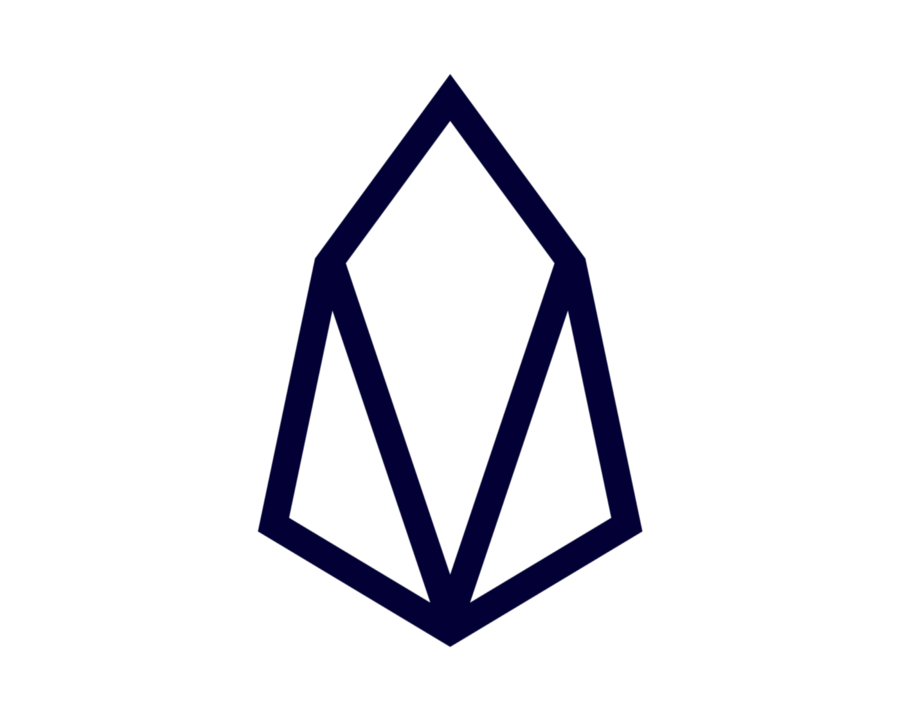

# Open Secure Storage
## EOS Smart-Contract for storage
----------------------
### Why

- Using smart-contracts to sell and buy online storage space

### Use

- Build then open browser to http://localhost:8080

```
  ./quick_start.sh
  cd frontend && npm install && npm start
  cd backend && npm install && npm start
```

### Design



### Refs
- EOS [tutorials](https://developers.eos.io/eosio-home/docs/introduction) online
- Orignal [fork](https://github.com/EOSIO/eosio-project-demux-example) code
